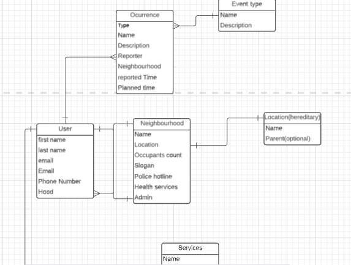

    <h1 align="center"><u>The Watch</u></h1>
    

The watch is an online platform meant to keep the registered users in the loop of what is going on in their own neighbourhoods.

    

        <h2>Contributions</h2>
        

            <h3>Contributors</h3>
            <ol>
                <li>Ken Mbira</li>
            </ol>
        

        

            <h3>How to become a contributor</h3>
            
If you wish to add to the project in development, follow the following

            

                <ul>
                    <li>Clone the project and work on it</li>
                    <li>Create a feature branch</li>
                    <li>After you have implemented all desired functionality contact me and i'll allow you to become a contributor</li>
                    <li>After this i'll review your code and then i'll merge to my production branch at which point it will be live</li>
                </ul>
            

        

    

    

        <h3>Technologies Used</h3>
        <ol>
            <li>Angular(frontend)</li>
            <li>Django & Django rest framework(backend)</li>
            <li>Cloudinary(storing files)</li>
            <li>Heroku(deployment)</li>
        </ol>
    

    

        <h3>App Breakdown</h3>
        

            <h4>Problem Statement</h4>
            
It is quite difficult for working individuals to keep tabs on what is going on in their neighbourhoods due to their busy schedules.

            <h4>Problem Solution</h4>
            
The Watch creates a solution in that it provides a platform for users to stay in the know of matters in their neighbourhoods by creating virtual representations of them. They can share upcoming events,as well as share important concerns in a place where all users can be able to see

            <h4>Functionality</h4>
            
The applications provides a database system to manage all these affairs as shown below:

            
        

    

    

        <h2>Set up locally</h2>
        
First make sure you have at least python 3.0, angular cli 8.0, and npm 14.0 installed.

        
Having the application in your local repo is quite easy: 

        

            <h3>Angular</h3>
            <ul>
            <li>Create a directory to house the entire application and from here on I will refer to it as <code>dir1</code> for reference purposes.</li>
            <li>While inside <code>dir1</code> run the following code <code>git clone https://github.com/Ken-mbira/Tuzo-front.git</code></li>
            <li>Then navigate to that file <code>TUZO</code> and run <code>npm install</code> to install all the requirements.</li>
            <li>Finally run <code>ng serve -o</code> to run the local server.</li>
            </ul>
        

        

            <h3>Django</h3>
            <ul>
            <li>Navigate to <code>dir1</code> and create another empty directory to house the backed bit.</li>
            <li>Inside this directory run <code>git clone https://github.com/Ken-mbira/Tuzo.git</code> and navigate into the directory <code>TUZO</code></li>
            <li>Create a virtual environment inside this repository <code>python3 -m venv --without-pip virtual</code> and activate it using <code>source virtual/bin/activate</code>.</li>
            <li>Run <code>pip instal -r requirements.txt</code></li>
            <li>Finally run <code>python3 manage.py runserver</code></li>
            </ul>
        

    

     

        <h2>Link to live site</h2>
        
You can see the application in action <a href="https://tuzobora.netlify.app/">here</a>

    

    

        <h2>Contact information</h2>
        
You can contact me using the following channels:

        <ol>
            <li>Phone: 0758926990</li>
            <li>Email: mbiraken17@gmail.com</li>
            <li>Git-hub: Ken-mbira</li>
            <li>Linked In: Ken Mbira</li>
            <li>Twitter: Ken Mbira</li>
        </ol>
    

    

        
Here are some of the resources that I relied on heavily through the development of the application: 

        <li><a href="https://angular.io/">The django rest documentation.</a></li>
        <li><a href="https://www.django-rest-framework.org/">Angular documentation.</a></li>
    

